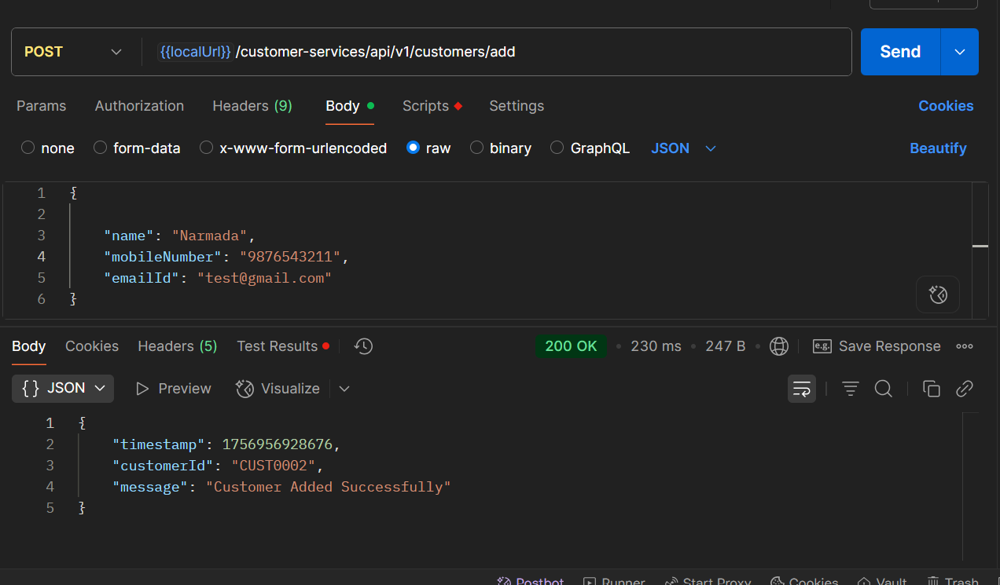

## Getting Started

### Prerequisites

- Java 17+
- Maven 3.8+
- Git
- IntelIj

### Clone the Repository

```bash
git clone  https://github.com/NarmadadeviS/customer-services-springboot.git
cd customer-services-springboot
```

# Customer Services API

This project is a Spring Boot-based REST API that add customer details, calculates and retrieves reward points earned by
customers based on
their purchase history. The reward calculation follows a tiered system and allows querying for reward summaries within a
specific date range.

---

## Features

- Add customer
- Add purchases for a customer along with reward points
- Reward Calculation Logic
  - No rewards for purchases below or equal to $50
  - 1 point per dollar for amounts between $51 and $100
  - 2 points per dollar for amounts above $100
- Fetch reward points by customer ID within a custom date range
- Breakdown of rewards per month
- H2 in-memory database for development
- MySQL support for production
- Input validation and centralized exception handling
- API-level request/response logging
- Unit and integration test

---

## Technology Stack

- Java 17
- Spring Boot 3.x
- Spring Data JPA
- H2 / MySQL
- Mockito
- Maven

---

## Design Details

### Architecture

- **Layered Architecture (Controller → Service → Repository)**
- **Spring Boot** framework using RESTful APIs.
- **JPA** for database access.
- **H2 (Dev)** and **MySQL (Prod)** database configurations using Spring Profiles.

### Data Flow

1.**Add Customer API**

- Accepts customer info via DTO.
- Generate a Customer ID.
- Saves customer info to DB.

2.**Add Purchase API**

- Accepts purchase info via DTO.
- Calculates reward points.
- Saves to DB and returns total reward points.

3.**Get Rewards API**

- Accepts customerId and date range.
- Fetches purchase data from DB.
- customer details, Aggregates monthly and total reward points.
- Returns a structured response DTO.

### Layer

- **Controller**: Defines API endpoints and input validation.
- **Service**: Contains business logic.
- **Repository**: Handles database operations.
- **Helper**: Handles the calculation logic.
- **DTOs**: Used for clean API contracts.
- **Exception Handling**: Centralized with `@RestControllerAdvice`.
- **Logging**: Request/response logs using filter.

## Preloaded Sample Data

To ease testing and demonstration, sample data is inserted into the H2 database using a `CommandLineRunner` when the
application starts.

- **Sample Customer**
  -- Insert customer
  INSERT INTO customer (id, customer_id, name, mobile_number, email_id)
  VALUES (1, 'CUST0001', 'Narmada', '9876543210', 'narmada@example.com');

- **Sample Purchases**

  -- Insert purchases
  INSERT INTO purchases (id, customer_id, amount, purchase_date, reward_points)
  VALUES
  (1, 'CUST0001', 120.0, CURRENT_DATE - 7, 90),
  (2, 'CUST0001', 75.0, CURRENT_DATE - 30, 25),
  (3, 'CUST0001', 220.0, CURRENT_DATE - 60, 290),
  (4, 'CUST0001', 130.0, CURRENT_DATE - 90, 110);

## API Endpoints

### 1. Add Customer

**POST** `customer-services/api/v1/customers/add`

**Request Body:**

```json
{
  "name": "Narmada",
  "mobileNumber": "9876543210",
  "emailId": "test@gmail.com"
}
```

**Response Body:**

```json
{
"customerId": "CUST0001",
"message": "Customer Added Successfully", 
"timestamp": 1756913346732
}
```

### 2. Add Purchase

**POST** `/customer-services/api/v1/add-purchase`

**Request Body:**

```json
{
  "customerId": "CUST0001",
  "amount": 100.0
}
```

**Response Body:**

```json
{
  "pointsEarned": 50,
  "totalRewardPoints": 50,
  "timestamp": 1756198551860
}
```

---

### 3. Get Rewards

**Get** `/customer-services/api/v1/get-rewards/CUST0001?startDate=2025-06-02&endDate=2025-09-04`

**Response Body:**

```json
{
  "customerId": "CUST0001",
  "name": "Narmada",
  "mobileNumber": "9876543210",
  "emailId": "narmada@example.com",
  "monthlyRewards": [
    {
      "month": "2025-08",
      "points": 115
    },
    {
      "month": "2025-07",
      "points": 290
    },
    {
      "month": "2025-06",
      "points": 110
    }
  ],
  "totalRewards": 515,
  "recentPurchases": [
    {
      "purchaseDate": "2025-08-28",
      "amount": 120.0,
      "rewardPoints": 90
    },
    {
      "purchaseDate": "2025-08-05",
      "amount": 75.0,
      "rewardPoints": 25
    },
    {
      "purchaseDate": "2025-07-06",
      "amount": 220.0,
      "rewardPoints": 290
    },
    {
      "purchaseDate": "2025-06-06",
      "amount": 130.0,
      "rewardPoints": 110
    }
  ],
  "timestamp": 1756956280399
}
```

---

## Screenshots

### Maven Build Success


### Application Started


### Successful Postman Response - Add Customer



### Successful Postman Response - Add Purchase


### Successful Postman Response - Get Rewards


## Note:

- Postman API collection and environment json is available inside resources folder.
- server port as 8089
